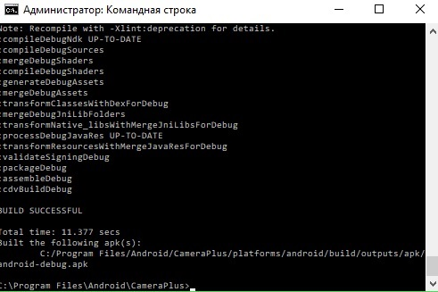
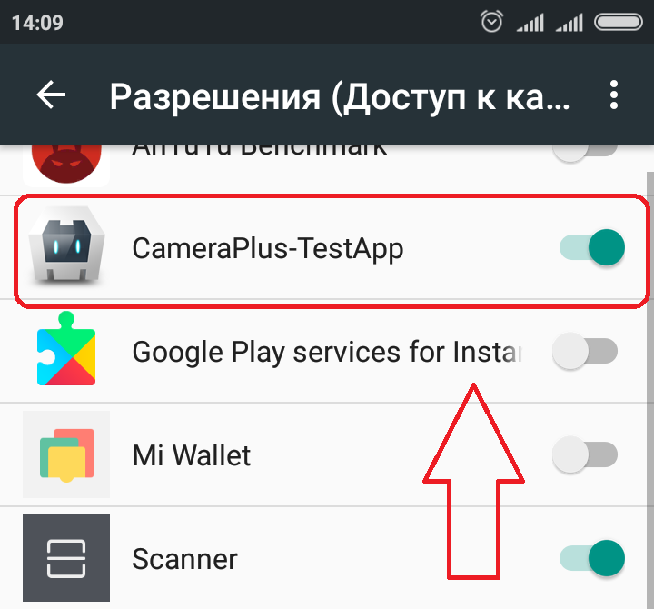

# Лабораторна робота №4: Розробка мобільного додатка

## Опис
Програма отримує доступ до камери. Дозволяє робити стоп-кадри за допомогою кнопки "Сфоткати" та вмикати відео з низькою частотою кадрів (функція "Стрім").

BUILD SUCCESSFUL!!! (після двох годин пихтіння над нескінченною (так здавалося) кількістю нових помилок, що виникали швидше, ніж виправлялися старі)

Для коректної роботи необхідно відкрити аплікації доступ до камери

Додаток встановлено успішно. З'явився ярлик

Кнопка "Сфоткати" працює коректно

Функція "Стрім" включає оновлення зображення з затримкою (частота кадрів ~ 6 FPS)

