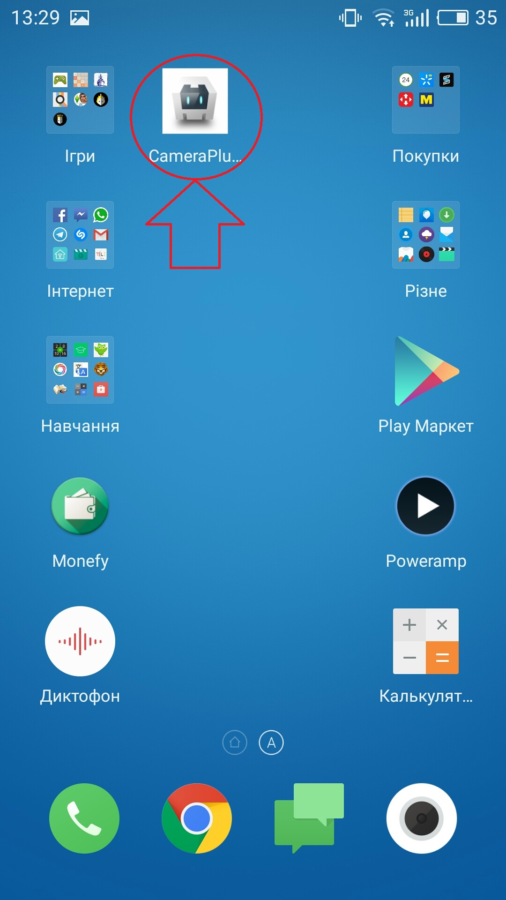
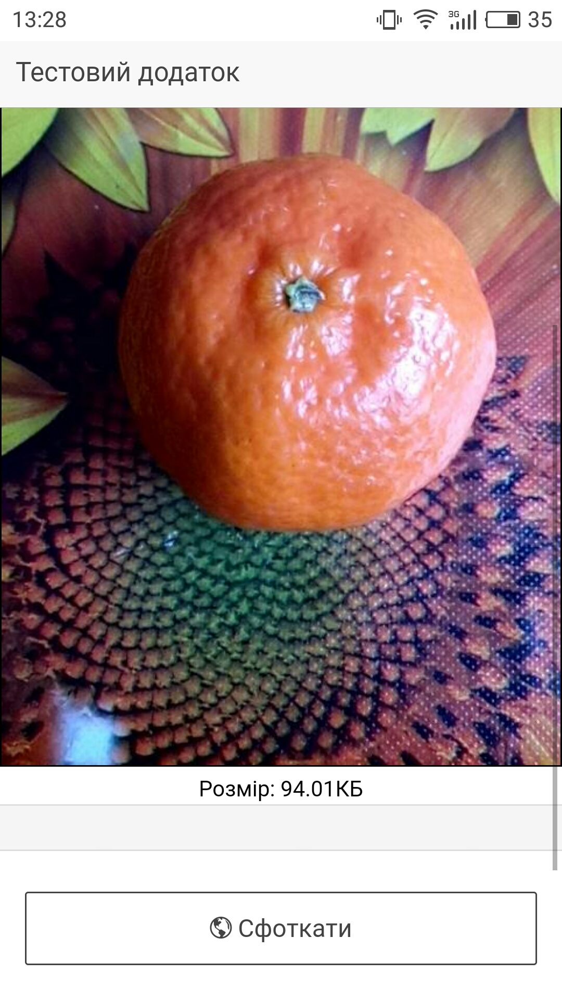

# Лабораторна робота №4: Розробка мобільного додатка

## Опис
Програма отримує доступ до камери. Дозволяє робити стоп-кадри за допомогою кнопки "Сфоткати" та вмикати відео з низькою частотою кадрів (функція "Стрім").

BUILD SUCCESSFUL!!! 

Додаток встановлено успішно. З'явився ярлик

Кнопка "Сфоткати" працює коректно

